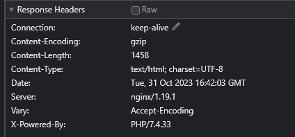

# Лабораторная работа №2. Инструменты разработчика в браузере

## Кручинин Е.С. АСБ-3-036

### Задание №1. Исследование заголовков и тела обычных запросов и их ответов.

- Request URL         - запрашиваемый URL, значение хота ресурса.
- Request Method      - метод GET запрашивает представление ресурса.
- Status Code         - код ответа (200 - выполнено успешно).
- Remote Address      - удаленный адрес, клиетский IP.
- Referrer Policy     - никакая информация о реферере не должна отправляться вместе с запросами, сделанными от конкретного клиента запроса к какому-либо источнику.
- content-type        - тип контента запрашиваемой страницы.
- cache-control       - задает инструкции кэширования запросов и ответов.
- cookie              - небольшие данные сохраняемые у пользователя
- user-agent          - это строка с характеристиками, по которым сервера и сетевые узлы могут определить тип приложения, операционную систему, производителя и/или версию пользовательского агента.
- referer             - содержит URL исходной страницы, с которой был осуществлён переход на текущую страницу.

#### Ответьте на вопросы:

1. *Что означает каждый из этих заголовков?*
    - Каждый из этих заголовков содержит информацию о получаемом ресурсе или о клиенте.
2. Из каких частей состоит Remote Address?
    - Remote Address состоит из номера сети (ip) и номера хоста (порта)
3. *Что означает порт подключения? — опишите как вы это понимаете своими словами*
    - **Порт подключения** - идентификатор получателя, по IP адресу пакет идет до компьютера, 
    - а с помощью порта, пакет определяет, какое приложение будет его обрабатывать.
4. *На какие секции разделены все заголовки? Какой смысл у каждой секции?*
    - General - применяется как к запросам, так и к ответам, но не имеет отношения к данным, передаваемым в теле.
    - Response Header - содержат дополнительную информацию об ответе, например его местонахождение, или о сервере, предоставившем его.
    - Request Header -  содержит больше информации о ресурсе, который нужно получить, или о клиенте, запрашивающем ресурс.
5. *Какие заголовки повторяются в нескольких секциях? Какой в этом смысл?*
    - cache-control - синхронизация настроек кэширования между браузером и сервером
6. *Что из себя представляет тело ответа?*
    - Тело ответа - это все данные о запрошенном ресурсе.

### Задание №2. Исследование указывающих ответов сервера.
При открытых во вкладке инструментах разработчика сделайте запрос на http://rgups.ru/ и обратите внимание на то изменился ли адрес в адресной строке? - Если Вы всё правильно сделали, то он должен был немного измениться. 
    - http://rgups.ru/ - вернул ответ 301 Moved Permanently и заменился на https://rgups.ru/

#### Изучите из-за чего так произошло и ответьте на вопросы:
1. *Из-за чего произошло изменение адреса в адресной строке? Какие заголовки в этом поучаствовали и как?*
    - Location - указывает URL для перенаправления на страницу
2. *Адрес был изменён в исходном запросе или потребовались дополнительные запросы, если были дополнительные запросы, то сколько?*
    - Адрес был изменен в исходном запросе
3. *Какой статус ответа имеет первоначальный запрос?*
    - 301 Moved Permanently

------------

### Задание №3. Исследование получения и передачи cookie.
*Повторите запрос на https://ya.ru/ и изучите заголовки влияющие на получение и отправку **cookie** параметров.*
- Set-Cookie - используется для отправки cookie непосредственно с сервера в клиент
- Cookie - Содержит сохраненные cookie связыные с сервером

#### После чего:
1. *Перечислите название этих параметров и формат данных в них.*
    - Name - Название файла.
    - Size - размер файла cookie.
    - Value - "Значение, связанное с данным именем cookie.(Любая строка/или данные, которые сохраняет комп.")
    - Domain - Сайт, к которому относятся cookie.
    - Path - "Создание cookie, для какой-то конкретной страницы на сайте."
    - Expires - Дата, когда истекает cookie.
2. *Как можно удобно просмотреть все cookie, используемые на странице? Что означают их параметры Name, Value, Domain, Path и Expires?*
    - С помощью инструментов разработчика
    - Name - Имя файла Cookie
    - Value - 
    - Domain - Домен, которому принадлежат Cookie
    - Path - 
    - Expires - Время жизник Cookie в формате даты
3. *Как просмотреть все cookie связанные с текущим (просматриваемым) сайтом?*
    - Перейти в средства разработчика и во вкладку Application и Storage - Cookies
4. *Опишите своими словами как вы понимаете суть и назначение cookie?*
    - Cookie - пользовательские файлы помогающие сайту идентифицировать одного и тогоже пользователя как единого. Также с помощью cookie отслеживаются ваши предпочтения на сайте.

------------

### Задание №4. Исследование построения документов и сопутствующих запросов.
Изучите вкладку Elements и дерево тегов документа. Изучите список запросов на вкладке Network.

#### Ответьте на вопросы:
1. *Что такое DOM? — Опишите своими словами*
    -  Дерево (структура) веб страницы в независимости от языка
2. *Может ли итоговый документ отличаться от тела ответа, полученного от сервера? Если да, то по каким причинам это может происходить?*
    - 
3. *Почему если вы сделали всего один запрос, в списке огромное количество запросов и ответов? Что они из себя представляют и на каком основании браузер их делает?*
    - Да, итоговый документ, который отображается веб-браузером, может отличаться от тела ответа, полученного от сервера.

    - Это может произойти из-за:

    Динамического содержимого: Некоторые части веб-страницы могут быть созданы или изменены с помощью JavaScript или других технологий на стороне клиента.

Это могут быть различные картинки формата .png, скрипты .script, шрифты font и так далее.
------------

### Задание №5. Определение параметров запроса.
Откройте главный сайт университета https://www.rgups.ru/services/time/. Используя инструменты разработчика вкладку Network определить запрос и параметры запроса
позволяющие получить ваше расписание.

#### Ответьте на вопросы:
1. *Запрос к какому эндпоинту необходимо выполнить для получения вашего расписания*
    - **https://www.rgups.ru/ajax/schedule.php?action=timetable&fac-id=1&course-id=3&group-id=26335&edu-type=internal**

2. *Что содержится в теле ответа*
    - 
3. *Какого типа запрос вы выполнили?*
    - get-запрос
4. *Какие данные вы использовали для получения расписания*
    - Часть URL идущая после знака "?" говорит серверу какие данные необходимо получить. **action: timetable fac-id: 1 course-id: 3 group-id: 26335 edu-type: internal**